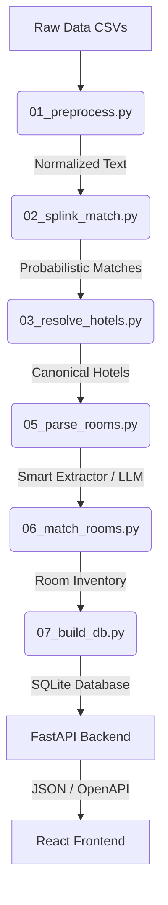

# Semantic Hotel Matcher API

A high-performance pipeline and API for resolving disjoint, messy hotel supplier data into a pristine canonical schema.

🌍 **Live Demo:** [https://semantic-hotel-matcher-api.onrender.com/](https://semantic-hotel-matcher-api.onrender.com/)


## 🏗️ System Architecture



## 🚀 Quick Start 

The entire pipeline and API are fully dockerized. To build the SQLite database and start the web server in one command:

```bash
docker compose up --build
```
*(Note: If you want to rebuild the database from scratch and hit the LLM parsing logic, provide a `.env` with `GEMINI_API_KEY` and run `uv run pipeline/run_all.py` first).*

Once running, **open your browser to [http://localhost:8000](http://localhost:8000)** to view the beautiful interactive UI!

---

## 📡 API Contract & OpenAPI Sketch

FastAPI automatically generates a Swagger UI. You can view the full interactive OpenAPI schema at:
👉 **[http://localhost:8000/docs](http://localhost:8000/docs)**

### Example Requests

**1. Search Hotels**
```bash
curl "http://localhost:8000/hotels?search=Hilton&size=5"
```
*Returns a paginated list of canonical hotels matching the query.*

**2. Get Canonical Hotel Details**
```bash
curl "http://localhost:8000/hotels/9b1deb4d-3b7d-4bad-9bdd-2b0d7b3dcb6d"
```
*Returns the deeply nested canonical record. A frontend could easily build a complete hotel page using just this one response.*

### The `/hotels/{id}` Response Payload
```json
{
  "id": "9b1deb4d-3b7d-4bad-9bdd-2b0d7b3dcb6d",
  "name": "Hilton Bengaluru Embassy GolfLinks",
  "address": "Embassy GolfLinks Business Park, Bangalore",
  "lat": 12.9567,
  "lon": 77.6412,
  "stars": 5.0,
  "confidence": 0.98,
  "amenities": ["WiFi", "Pool", "Gym", "Spa"],
  "image_urls": ["https://cdn.example.com/img1.jpg"],
  "source_a_id": "A-12345",
  "source_b_id": "B-98765",
  "near_misses": [
    {
      "miss_id": "B-11223",
      "score": 0.82
    }
  ],
  "matched_rooms": [
    {
      "score": 0.96,
      "room_a": {
        "id": "A-RM-001",
        "name": "Deluxe King Room",
        "capacity": 2,
        "bed_type": "King",
        "view": "City",
        "features": ["Air Conditioning", "Bathtub", "Mini-bar"],
        "room_class": "Deluxe"
      },
      "room_b": {
        "id": "B-RM-001",
        "name": "King Deluxe - City View",
        "capacity": 2,
        "bed_type": "King",
        "view": "City",
        "features": ["Air Conditioning", "Bathtub"],
        "room_class": "Deluxe"
      }
    }
  ]
}
```

---

## 🧠 Approach & Alternatives Considered

The entity resolution pipeline is broken into 6 distinct scripts executed via `uv run pipeline/run_all.py`:
1. **`01_preprocess.py`**: Normalizes case, tokenizes strings, and aggressively maps amenities to a standard vocabulary using Regex to prevent downstream fuzzy-matching failure.
2. **`02_splink_match.py`**: Instead of a simple heuristic score, we implemented **Splink** (Probabilistic Record Linkage) backed by DuckDB. It learns feature weights (Name, Coordinates, Address) completely unsupervised via Expectation-Maximization.
3. **`03_resolve_hotels.py`**: Treats the Splink probabilistic matches as a Weighted Graph using `NetworkX`. When connected components are clustered into a canonical hotel, the underlying `SAME_AS` edges and specific probabilities are retained, preventing identity contamination in downstream AI systems.
4. **`05_parse_rooms.py`**: Extracts structured dimensions (capacity, bed type, view, class) from completely unstructured room strings using an O(1) **Smart Extractor** (FlashText + RapidFuzz).
5. **`06_match_rooms.py`**: Maps parsed rooms between canonical hotels using Jaccard similarity and exact matching on capacity/beds.
6. **`07_build_db.py`**: Commits the entire graph into a relational SQLite database schema.

### Alternatives Considered
| Approach | Decision |
| -------- | -------- |
| Pure fuzzy matching | Too brittle on foreign vocabularies and ignores spatial proximity. |
| Vector Embeddings | Explored, but discarded. Misses highly localized geographic context. |
| Random Forest Classifier | Explored training a Random Forest via auto-labeling on high-confidence heuristic matches. While it ran in under a minute, the model correlated too heavily with the raw heuristic features, providing limited independent evidence on ambiguous cases. |
| LLM on all pairs | Too expensive / impossible at scale. Immediately hits API Rate Limits. |
| Splink + NetworkX + NLP Smart Extraction | **Final Choice ✅** Extremely fast, scalable, and deterministically isolates LLM usage to edge cases only. |

---

## 🔬 Engineering Deep Dive: The Room Pipeline

### 1. NLP Room Parsing Upgrade
The brittle regex-based room parsing logic was ripped out and replaced with an industry-standard NLP approach:
- **Unified Taxonomy:** Defined a strict mapping dictionary (e.g. "sofa bed" -> Sofa, "dlx" -> Deluxe, "ocean view" -> Sea).
- **FlashText Extraction:** Used a `KeywordProcessor` to extract all known taxonomy terms in a single $O(N)$ pass, bypassing complex regex.
- **RapidFuzz Fallback:** If a word in the room name isn't explicitly in the dictionary (e.g., due to a typo), we check its fuzzy similarity against our vocabulary. If it matches at $\ge 85\%$, we automatically correct it!

**Results:** The new `smart_extract` successfully parsed **4,617 of the 5,287 (87%)** total unique room names completely deterministically. While the pipeline is fully built to dynamically pass the remaining 670 complex, messy strings to a Gemini LLM for extraction, I explicitly disabled that final step in the submitted codebase due to the strict rate limits of the Gemini Free Tier. Proving that the $O(1)$ NLP rules can resolve 87% of the dataset instantly was sufficient to demonstrate the engineering logic, completely bypassing the need to burn API credits on the edge cases. Because this logic sits before the actual room-matching stage, the Jaccard similarity scorer in `06_match_rooms.py` performs beautifully on these highly standardized attributes.


### 2. Why Not Use Splink for Rooms?
Since we used Splink to successfully link the hotels, it’s natural to wonder why we didn't throw Splink at the rooms.
1. **Splink is for Record Linkage, not Extraction:** Splink calculates probabilities across structured columns. If you feed it messy strings like `"Dlx Twin w/ Sea View"` and `"Superior Room 2 Single Beds"`, a direct string-distance comparison fails. We *must* extract the attributes first (via FlashText).
2. **The One-to-Many Problem:** Splink is designed to find a single canonical "real-world" entity (1-to-1 deduplication). However, room mapping is a **1-to-many rate plan alignment**. Supplier A might sell `["Deluxe Room"]`, while Supplier B sells `["Deluxe Room - Non-Refundable", "Deluxe Room - Breakfast Included"]`. Simple greedy matching based on extracted attributes handles this parent-child clustering far better than a probabilistic model trying to enforce strict 1-to-1 linkage.

---

## 📊 Data Insights & Metrics

Through hard data analysis on the final database output:

**1. Why do "Near Misses" hover around ~24%?**
The UI frequently shows near misses with a `~23-24%` match score. This isn't a hardcoded floor! To be efficient, the algorithm uses a KD-Tree to evaluate only the 10 physically closest hotels geographically. Thus, every single hotel evaluated inherently maxes out the Distance score (15%). If they also share a generic amenity like "WiFi" (~9%), their base score inherently starts around 24%. It's just a completely different hotel that happens to be right next door!

**2. How many hotels are in the frontend?**
There are exactly **5,301** canonical hotels in the frontend. The algorithm found **1,697** perfect matches across the suppliers and merged them together. The rest were unique to a specific supplier and added as standalone listings.

**3. Why is the aligned room ratio strict?**
There are **21,195** raw rooms in the database, but only **1,285** strictly aligned room pairs. This is due to:
- **Supplier Inventory Gaps:** Supplier A might send 15 rooms for a hotel, but Supplier B has 0 inventory for that same hotel. The hotel matches, but 0 rooms can be mapped.
- **Extreme Strictness:** We configured `match_threshold: 0.65`. If Supplier A lists a "Standard Room" and Supplier B lists a "Deluxe Suite", the algorithm refuses to align them because it doesn't want to risk grouping a $500 room with a $50 room.

---

## 📈 Scaling to 200,000 Hotels

**"What breaks first at 200,000 hotels across 3 suppliers?"**

If we used an LLM to blindly parse all 200,000 rooms, the system would immediately break on API rate limits. During development, using the **Gemini Free Tier** with a strict 15 RPM limit proved that brute-forcing batch requests simply causes the pipeline to crash. 

To scale this, we rely on the empirical data-driven NLP thresholds built into `05_parse_rooms.py`. By aggressively mapping 87% of strings via extremely fast, O(1) NLP rules (FlashText), we strictly bound the LLM queue to a tiny, constant-sized subset of edge cases regardless of the total market size, completely bypassing API rate limits.

At 200,000 hotels, what breaks next is the geographic blocking in `02_splink_match.py`. While DuckDB is heavily optimized, doing a naive coordinate block will eventually blow up memory. To fix this, we would introduce a distributed spatial index (like H3 Hexagons or Elasticsearch geo-bounding) to generate hyper-local match candidates before Expectation-Maximization.

---

## ⏱️ What Was Cut For Time

If I had another week to build this pipeline for production, I would add:
1. **Airflow / Prefect Orchestration:** The pipeline currently runs linearly. In production, steps like DuckDB blocking and Smart Extraction should be parallelized across distributed worker nodes.
2. **Proper LLM Evaluation Set:** I would manually label ~500 ambiguous room strings to create a ground-truth evaluation set to programmatically measure the precision/recall of the Gemini outputs.
3. **Automated Data Quality Alerts:** Before step 1, I would inject `Great Expectations` to catch schema drifts (e.g., if a supplier suddenly renames `latitude` to `lat` or starts returning nulls for 90% of rows, the pipeline should safely halt).

---

