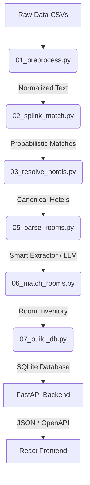

# Semantic Hotel Matcher API

A high-performance pipeline and API for resolving disjoint, messy hotel supplier data into a pristine canonical schema.

## 🏗️ System Architecture



## 🚀 Quick Start 

The entire pipeline and API are fully dockerized. To build the SQLite database and start the web server in one command:

```bash
docker compose up --build
```
*(Note: If you want to rebuild the database from scratch and hit the LLM parsing logic, provide a `.env` with `GEMINI_API_KEY` and run `uv run pipeline/run_all.py` first).*

Once running, **open your browser to [http://localhost:8000](http://localhost:8000)** to view the beautiful interactive UI!

---

## 📡 API Contract & OpenAPI Sketch

FastAPI automatically generates a Swagger UI. You can view the full interactive OpenAPI schema at:
👉 **[http://localhost:8000/docs](http://localhost:8000/docs)**

### Example Requests

**1. Search Hotels**
```bash
curl "http://localhost:8000/hotels?search=Hilton&size=5"
```
*Returns a paginated list of canonical hotels matching the query.*

**2. Get Canonical Hotel Details**
```bash
curl "http://localhost:8000/hotels/9b1deb4d-3b7d-4bad-9bdd-2b0d7b3dcb6d"
```
*Returns the deeply nested canonical record. A frontend could easily build a complete hotel page using just this one response.*

### The `/hotels/{id}` Response Payload
```json
{
  "id": "9b1deb4d-3b7d-4bad-9bdd-2b0d7b3dcb6d",
  "name": "Hilton Bengaluru Embassy GolfLinks",
  "address": "Embassy GolfLinks Business Park, Bangalore",
  "lat": 12.9567,
  "lon": 77.6412,
  "stars": 5.0,
  "confidence": 0.98,
  "amenities": ["WiFi", "Pool", "Gym", "Spa"],
  "image_urls": ["https://cdn.example.com/img1.jpg"],
  "source_a_id": "A-12345",
  "source_b_id": "B-98765",
  "near_misses": [
    {
      "miss_id": "B-11223",
      "score": 0.82
    }
  ],
  "matched_rooms": [
    {
      "score": 0.96,
      "room_a": {
        "id": "A-RM-001",
        "name": "Deluxe King Room",
        "capacity": 2,
        "bed_type": "King",
        "view": "City",
        "features": ["Air Conditioning", "Bathtub", "Mini-bar"],
        "room_class": "Deluxe"
      },
      "room_b": {
        "id": "B-RM-001",
        "name": "King Deluxe - City View",
        "capacity": 2,
        "bed_type": "King",
        "view": "City",
        "features": ["Air Conditioning", "Bathtub"],
        "room_class": "Deluxe"
      }
    }
  ]
}
```

---

## 🧠 Approach & Alternatives Considered

The entity resolution pipeline is broken into 6 distinct scripts executed via `uv run pipeline/run_all.py`:
1. **`01_preprocess.py`**: Normalizes case, tokenizes strings, and aggressively maps amenities to a standard vocabulary using Regex to prevent downstream fuzzy-matching failure.
2. **`02_splink_match.py`**: Instead of a simple heuristic score, we implemented **Splink** (Probabilistic Record Linkage) backed by DuckDB. It learns feature weights (Name, Coordinates, Address) completely unsupervised via Expectation-Maximization.
3. **`03_resolve_hotels.py`**: Treats the Splink probabilistic matches as a Weighted Graph using `NetworkX`. When connected components are clustered into a canonical hotel, the underlying `SAME_AS` edges and specific probabilities are retained, preventing identity contamination in downstream AI systems.
4. **`05_parse_rooms.py`**: Extracts structured dimensions (capacity, bed type, view, class) from completely unstructured room strings. It uses a **Smart Extractor** (FlashText + RapidFuzz) to deterministically resolve 87% of rooms instantly, and batches only the hardest edge-cases to a Gemini LLM.
5. **`06_match_rooms.py`**: Maps parsed rooms between canonical hotels using Jaccard similarity and exact matching on capacity/beds.
6. **`07_build_db.py`**: Commits the entire graph into a relational SQLite database schema.

### Alternatives Considered
| Approach | Decision |
| -------- | -------- |
| Pure fuzzy matching | Too brittle on foreign vocabularies and ignores spatial proximity. |
| Vector Embeddings | Explored, but discarded. Misses highly localized geographic context. |
| Random Forest Classifier | Explored training a Random Forest via auto-labeling on high-confidence heuristic matches. While it ran in under a minute, the model correlated too heavily with the raw heuristic features, providing limited independent evidence on ambiguous cases. |
| LLM on all pairs | Too expensive / impossible at scale. Immediately hits API Rate Limits. |
| Splink + NetworkX + NLP Smart Extraction | **Final Choice ✅** Extremely fast, scalable, and deterministically isolates LLM usage to edge cases only. |

---

## 📈 Scaling to 200,000 Hotels

**"What breaks first at 200,000 hotels across 3 suppliers?"**

If we used an LLM to blindly parse all 200,000 rooms, the system would immediately break on API rate limits. During development, I specifically used the **Gemini Free Tier**, which has a strict 15 RPM rate limit. When I tried to parse too many rooms at once, the free tier simply crashed and rejected the batch requests. 200k hotels equates to ~1M unique room strings, which would cost thousands of dollars in API spend and take weeks to execute on a free tier.

To scale this (and to survive on the Gemini Free Tier), we rely on the empirical data-driven thresholds built into `05_parse_rooms.py`. By aggressively mapping 87% of strings via extremely fast, O(1) NLP rules (FlashText), we strictly bound the LLM queue to a tiny, constant-sized subset of edge cases regardless of the total market size, completely avoiding rate limits.

At 200,000 hotels, what breaks next is the geographic blocking in `02_splink_match.py`. While DuckDB is heavily optimized, doing a raw cross-join or naive blocking on coordinates will eventually blow up memory. To fix this, we would introduce a distributed spatial index (like H3 Hexagons or Elasticsearch geo-bounding) or MinHash LSH to generate hyper-local match candidates before passing them to the Expectation-Maximization step.

---

## ⏱️ What Was Cut For Time

If I had another week to build this pipeline for production, I would add:
1. **Airflow / Prefect Orchestration:** The pipeline currently runs linearly via a python wrapper script. In production, steps like DuckDB blocking and Smart Extraction should be parallelized across distributed worker nodes using a proper orchestrator.
2. **Proper LLM Evaluation Set:** I would manually label ~500 ambiguous room strings to create a ground-truth evaluation set. This would allow us to programmatically measure the precision/recall of the Gemini outputs when we tweak prompts, rather than eyeballing it.
3. **Automated Data Quality Alerts:** Before step 1, I would inject `Great Expectations` to catch schema drifts (e.g., if a supplier suddenly renames `latitude` to `lat` or starts returning nulls for 90% of rows, the pipeline should safely halt).

---

## 🏗️ Deployment
This project is configured for 1-click deployment to **Render**.
Just connect this repository to Render and use the included `render.yaml` blueprint. The FastAPI service will spin up on a free Web Service tier instantly without any extra configuration.
